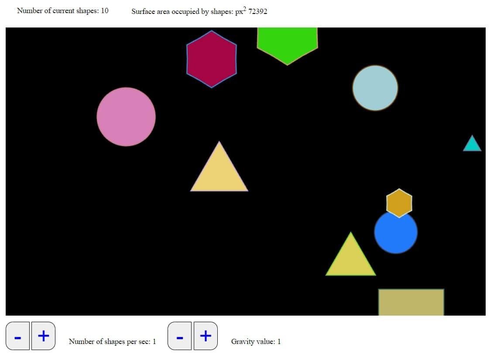
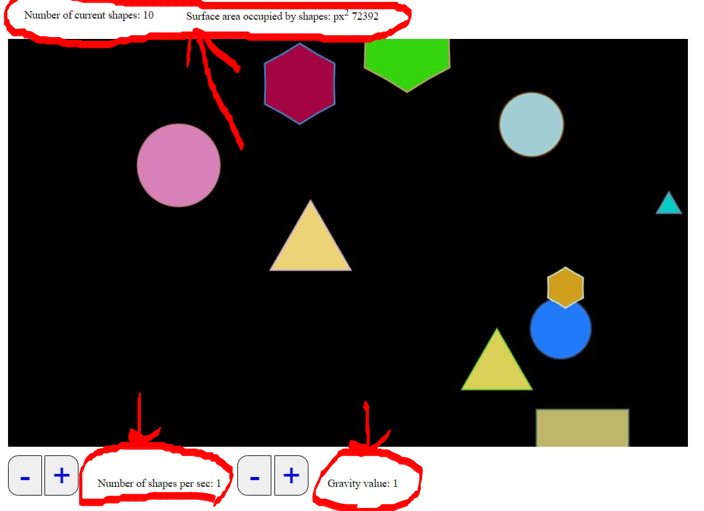
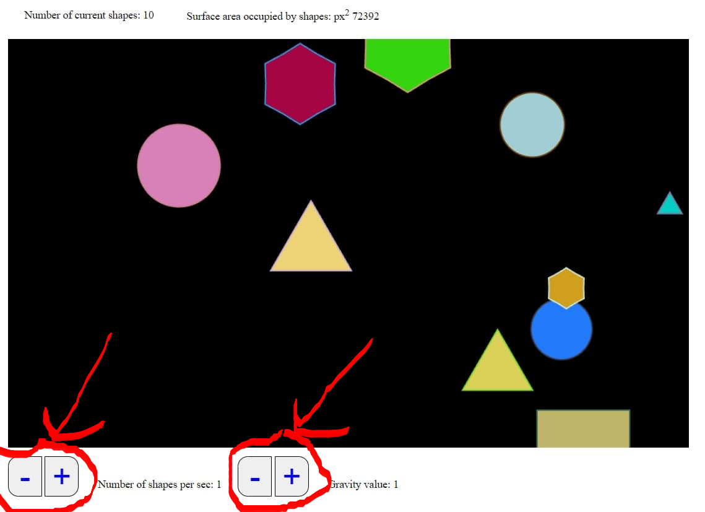

# pixi-demo
## How to lauch project
(You have to have Node JS installed)
 
Open console and type consecutively:
### `npm install`
Wait untill in download all packages and then type
### `npm start`
Project will start on http://localhost:1234
or other port if 1234 is busy, port will be displayed in console
 
Open your browser and open 
### `http://localhost:[displayed port]`
## Example of how the app works

Goal of this application is to demonstrate features of PIXI.js
 
You can see a bunch of different color and size shapes that fall from the top of the scene
If you click on one of those shapes it will disappear and change color of similar shapes. And if you click on free space new random shape will be created.

Here you can see a bunch of different indicators which display such things as:
 
- Number of shapes that are currently on screen  
- Area in square pixels that is occupied by shapes on screen  
- Number of shapes that generates every second  
- Gravity or speed at which shapes are approaching the bottom of the screen

Also you can control "Number of shapes per second" and "Gravity" values via buttons bellow the screen.
